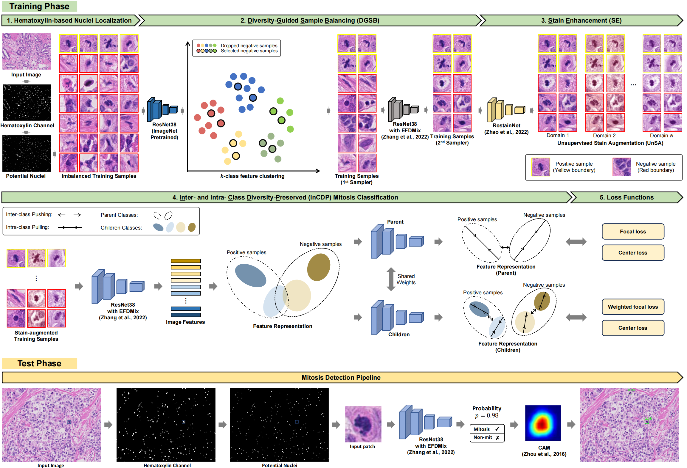

# Rethinking Mitosis Detection: Balancing and Diversifying Data and Feature Representation


## Introduction
The implementation of **[Rethinking Mitosis Detection: Balancing and Diversifying Data and Feature Representation]()**.

## Abstract
Mitosis detection is one of the fundamental tasks in computational pathology, which is extremely challenging due to the heterogeneity of mitotic cell. Most of the current studies solve the heterogeneity in the technical aspect by increasing the model complexity. However, lacking consideration of the biological knowledge and the complex model design may lead to the overfitting problem while limited the generalizability of the detection model. In this paper, we systematically study the morphological appearances in different mitotic phases as well as the ambiguous non-mitotic cells and identify that balancing the data and feature diversity can lead to better generalizability. Based on this observation, we propose a novel generalizable framework (MitDet) for mitosis detection. The data diversity is considered by the proposed diversity-guided sample balancing (DGSB) and unsupervised stain augmentation (UnSA). And the feature diversity is preserved by inter- and intra- class feature diversity-preserved module (InCDP). Extensive experiments have demonstrated that our proposed model outperforms all the SOTA approaches in several popular mitosis detection datasets in both internal and external test sets using minimal annotation effort with point annotations only. Comprehensive ablation studies have also proven the effectiveness of the rethinking of data and feature diversity balancing. By analyzing the results quantitatively and qualitatively, we believe that our proposed model not only achieves SOTA performance but also might inspire the future studies in new perspectives.

## Updates / TODOs
Please follow this GitHub for more updates.
- [ ] Add training code
- [X] Add detecting code
- [X] Add model

## Requirements
- Python 3.9
- pytorch
- CUDA
- 1×GPU

## Datasets
* Download training challenge [MIDOG2021](https://imig.science/midog/download-dataset/)

* External independent  datasets :  1.[AMIDA2013](https://tupac.grand-challenge.org/Dataset/)   2.[MITOSIS2014](https://mitos-atypia-14.grand-challenge.org/Dataset/)  3.[TUPAC2016](https://tupac.grand-challenge.org/Dataset/)  4.[MIDOG2022](https://imig.science/midog/download-dataset/)
## Checkpoints
Download our checkpoints of the final models trained from the [Google Drive]() and [baidu cloud]() 


## Detect
-You can download the test data from [here]() or use your own data for inference in the following format:

path/ 


    |_ png/
    |  |_ 007.png
    
    |_ CSV/
    |  |_ 007.csv


```
python detect.py 
```
    
 
    
    
